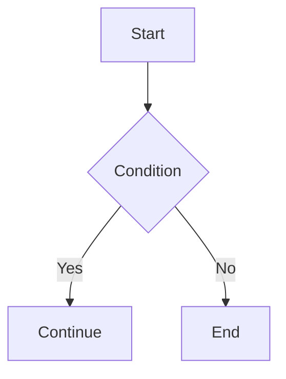
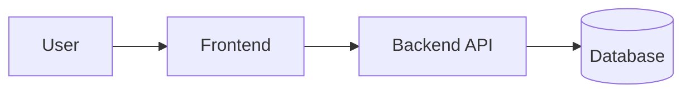
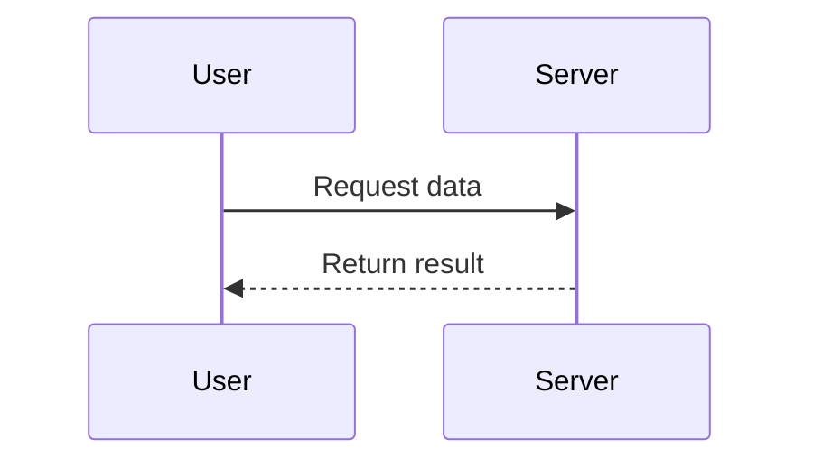
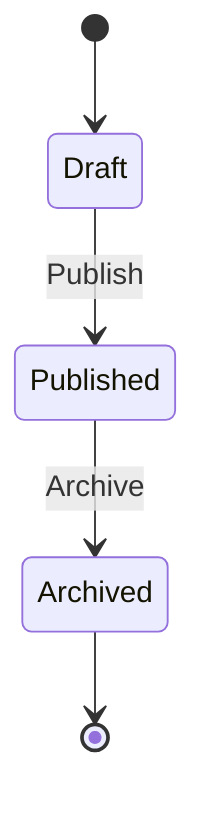

# Mermaid Diagram

Mermaid is a text-based diagram tool for Markdown, useful for flowcharts, sequence diagrams, state diagrams, and more.

In Firefly, Mermaid support is built-in and does not require a dedicated config file. Use a `mermaid` fenced code block directly in posts.

## Usage

```md

```

## Common Examples

### Flowchart



### Sequence Diagram



### State Diagram



## Notes

- Mermaid diagrams are rendered on the client side.
- The fenced code block language must be `mermaid`.
- If rendering fails, validate Mermaid syntax first.

See [Mermaid Official Docs](https://mermaid.js.org/intro/).
