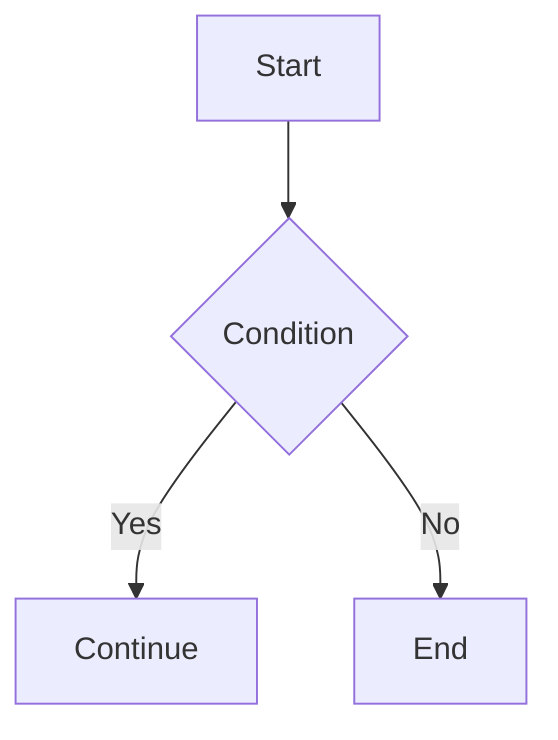

# Mermaid Diagram

Mermaid is a text-based diagram tool for Markdown. In Firefly, Mermaid diagrams are **rendered as static SVG at build time** using [beautiful-mermaid](https://github.com/lukilabs/beautiful-mermaid) — no client-side JavaScript is needed.

## Config File

`src/config/mermaidConfig.ts`

| Property | Type | Default | Description |
|----------|------|---------|-------------|
| `lightTheme` | `string` | `"github-light"` | Theme used in light mode |
| `darkTheme` | `string` | `"github-dark"` | Theme used in dark mode |

```ts
export const mermaidConfig: MermaidConfig = {
  lightTheme: "github-light",
  darkTheme: "github-dark",
};
```

### Available Themes

**Light themes:** `zinc-light`, `tokyo-night-light`, `catppuccin-latte`, `nord-light`, `github-light`, `solarized-light`

**Dark themes:** `zinc-dark`, `tokyo-night`, `tokyo-night-storm`, `catppuccin-mocha`, `nord`, `dracula`, `github-dark`, `solarized-dark`, `one-dark`

## Usage

Use a `mermaid` fenced code block directly in posts:

````md

````

## Supported Diagram Types

| Type | Syntax |
|------|--------|
| Flowchart | `graph TD` / `graph LR` / `flowchart` |
| Sequence Diagram | `sequenceDiagram` |
| Class Diagram | `classDiagram` |
| State Diagram | `stateDiagram-v2` |
| ER Diagram | `erDiagram` |
| XY Chart | `xychart-beta` |

::: warning
Gantt charts, pie charts, mindmaps, and timelines are **not supported** by beautiful-mermaid. These will show an error message with the original source code.
:::

## Notes

- Diagrams are rendered as static SVG during the Astro build — no CDN or client-side JS.
- Light and dark SVGs are generated simultaneously; CSS automatically switches based on the current theme.
- If rendering fails, the build log shows the error details and the page displays a fallback with the original code.
- Pan-zoom and fullscreen controls are provided by a shared plugin (also used by PlantUML).

See also: [PlantUML Diagram](./plantuml.md)

See [beautiful-mermaid](https://github.com/lukilabs/beautiful-mermaid) for more details.
