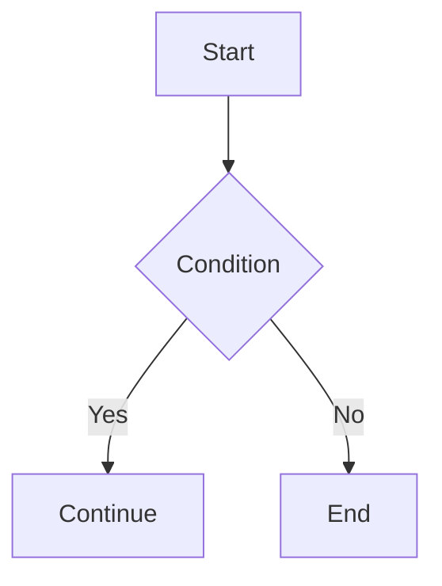

# Mermaid Diagram

Mermaid is a text-based diagram tool for Markdown. In Firefly, Mermaid diagrams are **rendered as static SVG at build time** using [merman](https://github.com/Latias94/merman), without a client-side Mermaid runtime.

## Config File

`src/config/mermaidConfig.ts`

| Property | Type | Default | Description |
|----------|------|---------|-------------|
| `lightTheme` | `string` | `"editor-light"` | Theme used in light mode |
| `darkTheme` | `string` | `"editor-dark"` | Theme used in dark mode |

```ts
export const mermaidConfig: MermaidConfig = {
  lightTheme: "editor-light",
  darkTheme: "editor-dark",
};
```

### Available Themes

**Light themes:** `editor-light`, `gruvbox-light`, `ayu-light`

**Dark themes:** `editor-dark`, `one-dark`, `gruvbox-dark`, `ayu-dark`

## Usage

Use a `mermaid` fenced code block directly in posts:

````md

````

## Supported Diagram Types

| Type | Syntax |
|------|--------|
| Flowchart | `graph TD` / `graph LR` / `flowchart` |
| Sequence Diagram | `sequenceDiagram` |
| Class Diagram | `classDiagram` |
| State Diagram | `stateDiagram-v2` |
| ER Diagram | `erDiagram` |
| XY Chart | `xychart-beta` |
| Gantt Chart | `gantt` |
| Pie Chart | `pie` |
| Mindmap | `mindmap` |
| Timeline | `timeline` |
| User Journey | `journey` |
| Git Graph | `gitGraph` |
| Kanban | `kanban` |
| Sankey Diagram | `sankey-beta` |
| Architecture Diagram | `architecture-beta` |
| C4, Requirement, Radar, Treemap, and more | Corresponding Mermaid syntax |

::: warning
Firefly currently pins `@mermanjs/web@0.8.0-alpha.3`. Merman is still in alpha; refer to its [alignment status](https://github.com/Latias94/merman/blob/main/docs/alignment/STATUS.md) for current compatibility details.
:::

## Notes

- Diagrams are rendered as static SVG through WASM during the Astro build, with no CDN or client-side Mermaid JS.
- Light and dark SVGs are generated simultaneously; CSS automatically switches based on the current theme.
- If rendering fails, the build log shows the error details and the page displays a fallback with the original code.
- Pan-zoom and fullscreen controls are provided by a shared plugin (also used by PlantUML).

See also: [PlantUML Diagram](./plantuml.md)

See [merman](https://github.com/Latias94/merman) for more details.
