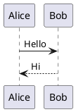

# PlantUML Diagram

PlantUML configuration controls how `plantuml` fenced code blocks are rendered in Markdown, including enablement, server endpoint, and light/dark themes.

## Config File

`src/config/plantumlConfig.ts`

## Properties

| Property | Type | Default | Description |
|----------|------|---------|-------------|
| `enable` | `boolean` | `true` | Enable PlantUML rendering. When disabled, `plantuml` blocks fall back to regular code highlighting. |
| `server` | `string` | `"https://www.plantuml.com/plantuml"` | PlantUML server base URL. You can use the official server or a self-hosted one. |
| `lightTheme` | `string` | `""` | Theme injected in light mode (`!theme <name>`). Empty string means no injection. |
| `darkTheme` | `string` | `"cyborg"` | Theme injected in dark mode (`!theme <name>`). Empty string means no injection. |

```ts
export const plantumlConfig: PlantUMLConfig = {
  enable: true,
  server: "https://www.plantuml.com/plantuml",
  lightTheme: "",
  darkTheme: "cyborg",
};
```

## Example

````md

````

## Theme Injection Rules

- If the source already contains `!theme` or `skinparam backgroundColor`, no extra theme will be injected.
- If both `lightTheme` and `darkTheme` are empty, PlantUML defaults are used.
- If `lightTheme` and `darkTheme` differ, the page switches diagram source based on current color mode.

## Server Recommendation

- For public content, the default official server is usually enough.
- For sensitive architecture diagrams, use a self-hosted `plantuml/plantuml-server` and change `server`.
- Trailing slash is optional; the URL is normalized automatically.

::: warning
Restart the Astro dev server after changing this configuration.
:::

See also:

- [PlantUML Theme](https://plantuml.com/theme)
- [PlantUML Server](https://plantuml.com/server)
