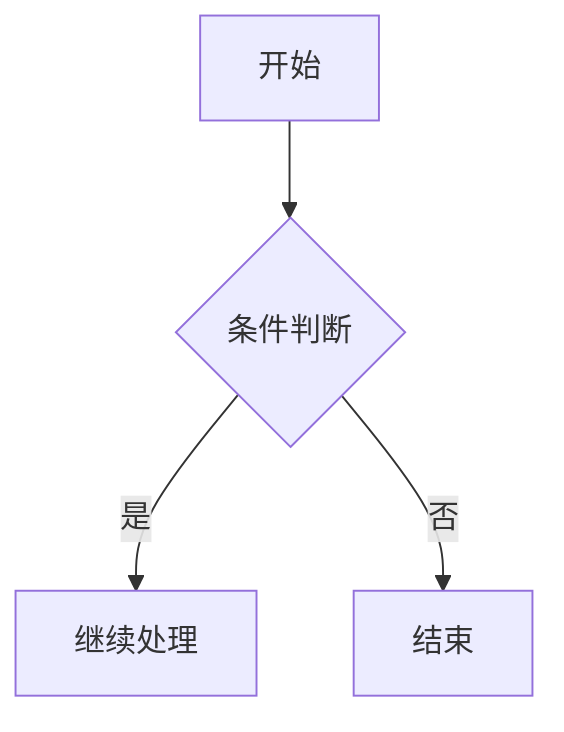
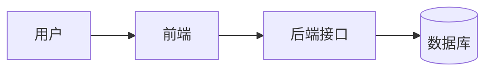
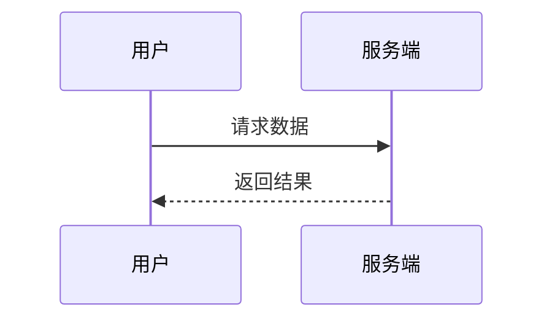
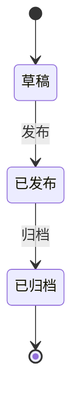

# Mermaid 图表

Mermaid 是基于文本语法的图表工具，适合在 Markdown 中快速绘制流程图、时序图、状态图等。

在 Firefly 中，Mermaid 为内置能力，无需额外配置文件；只要在文章中使用 `mermaid` 代码块即可渲染。

## 使用方式

```md

```

## 常见图表示例

### 流程图



### 时序图



### 状态图



## 说明

- Mermaid 图表会在页面端渲染。
- 代码块语言必须是 `mermaid`。
- 图表语法错误时，页面会显示渲染失败信息，请先检查 Mermaid 语法。

更多语法请参考 [Mermaid 官方文档](https://mermaid.js.org/intro/).
