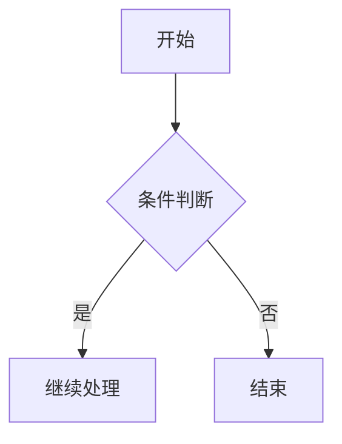

# Mermaid 图表

Mermaid 是基于文本语法的图表工具。在 Firefly 中，Mermaid 图表使用 [merman](https://github.com/Latias94/merman) 在**构建时渲染为静态 SVG**，无需客户端 Mermaid 运行时。

## 配置文件

`src/config/mermaidConfig.ts`

| 属性 | 类型 | 默认值 | 说明 |
|------|------|--------|------|
| `lightTheme` | `string` | `"editor-light"` | 亮色模式主题 |
| `darkTheme` | `string` | `"editor-dark"` | 暗色模式主题 |

```ts
export const mermaidConfig: MermaidConfig = {
  lightTheme: "editor-light",
  darkTheme: "editor-dark",
};
```

### 可用主题

**亮色主题：** `editor-light`、`gruvbox-light`、`ayu-light`

**暗色主题：** `editor-dark`、`one-dark`、`gruvbox-dark`、`ayu-dark`

## 使用方式

在文章中使用 `mermaid` 代码块即可：

````md

````

## 支持的图表类型

| 类型 | 语法 |
|------|------|
| 流程图 | `graph TD` / `graph LR` / `flowchart` |
| 时序图 | `sequenceDiagram` |
| 类图 | `classDiagram` |
| 状态图 | `stateDiagram-v2` |
| ER 图 | `erDiagram` |
| XY 图表 | `xychart-beta` |
| 甘特图 | `gantt` |
| 饼图 | `pie` |
| 思维导图 | `mindmap` |
| 时间线 | `timeline` |
| 用户旅程图 | `journey` |
| Git 图 | `gitGraph` |
| 看板 | `kanban` |
| Sankey 图 | `sankey-beta` |
| 架构图 | `architecture-beta` |
| C4、需求、雷达、树图等 | 对应 Mermaid 语法 |

::: warning
Firefly 当前固定使用 `@mermanjs/web@0.8.0-alpha.3`。Merman 仍处于 alpha 阶段，具体兼容范围以其[支持状态](https://github.com/Latias94/merman/blob/main/docs/alignment/STATUS.md)为准。
:::

## 说明

- 图表在 Astro 构建阶段通过 WASM 渲染为静态 SVG，不依赖 CDN 或客户端 Mermaid JS。
- 同时生成亮色和深色两套 SVG，CSS 根据当前主题自动切换。
- 渲染失败时，构建日志会输出错误详情，页面显示原始代码作为降级。
- pan-zoom 和全屏控制由共享插件提供（PlantUML 同样使用）。

另见：[PlantUML 图表](./plantuml.md)

更多详情请参考 [merman](https://github.com/Latias94/merman)。
