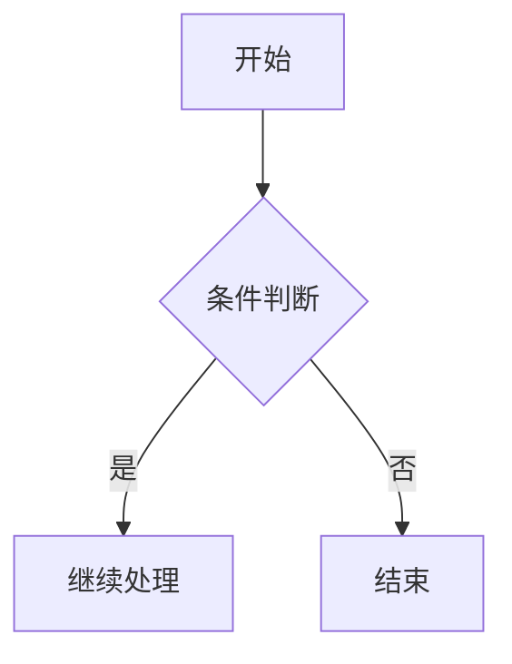

# Mermaid 图表

Mermaid 是基于文本语法的图表工具。在 Firefly 中，Mermaid 图表在**构建时渲染为静态 SVG**，使用 [beautiful-mermaid](https://github.com/lukilabs/beautiful-mermaid)，无需客户端 JavaScript。

## 配置文件

`src/config/mermaidConfig.ts`

| 属性 | 类型 | 默认值 | 说明 |
|------|------|--------|------|
| `lightTheme` | `string` | `"github-light"` | 亮色模式主题 |
| `darkTheme` | `string` | `"github-dark"` | 暗色模式主题 |

```ts
export const mermaidConfig: MermaidConfig = {
  lightTheme: "github-light",
  darkTheme: "github-dark",
};
```

### 可用主题

**亮色主题：** `zinc-light`、`tokyo-night-light`、`catppuccin-latte`、`nord-light`、`github-light`、`solarized-light`

**暗色主题：** `zinc-dark`、`tokyo-night`、`tokyo-night-storm`、`catppuccin-mocha`、`nord`、`dracula`、`github-dark`、`solarized-dark`、`one-dark`

## 使用方式

在文章中使用 `mermaid` 代码块即可：

````md

````

## 支持的图表类型

| 类型 | 语法 |
|------|------|
| 流程图 | `graph TD` / `graph LR` / `flowchart` |
| 时序图 | `sequenceDiagram` |
| 类图 | `classDiagram` |
| 状态图 | `stateDiagram-v2` |
| ER 图 | `erDiagram` |
| XY 图表 | `xychart-beta` |

::: warning
beautiful-mermaid **不支持**甘特图、饼图、思维导图和时间线。这些类型会显示错误信息和原始代码。
:::

## 说明

- 图表在 Astro 构建阶段渲染为静态 SVG，不依赖 CDN 或客户端 JS。
- 同时生成亮色和深色两套 SVG，CSS 根据当前主题自动切换。
- 渲染失败时，构建日志会输出错误详情，页面显示原始代码作为降级。
- pan-zoom 和全屏控制由共享插件提供（PlantUML 同样使用）。

另见：[PlantUML 图表](./plantuml.md)

更多详情请参考 [beautiful-mermaid](https://github.com/lukilabs/beautiful-mermaid)。
