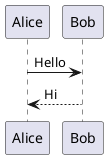

# PlantUML 图表

PlantUML 配置用于控制 Markdown 中 `plantuml` 代码块的渲染行为，包括是否启用、服务端地址和亮暗主题。

## 配置文件

`src/config/plantumlConfig.ts`

## 配置项

| 属性 | 类型 | 默认值 | 说明 |
|------|------|--------|------|
| `enable` | `boolean` | `true` | 是否启用 PlantUML 渲染。关闭后 `plantuml` 代码块会退化为普通代码高亮。 |
| `server` | `string` | `"https://www.plantuml.com/plantuml"` | PlantUML 服务地址。支持官方服务或自建服务。 |
| `lightTheme` | `string` | `""` | 亮色模式注入主题名（`!theme <name>`）。空字符串表示不注入。 |
| `darkTheme` | `string` | `"cyborg"` | 暗色模式注入主题名（`!theme <name>`）。空字符串表示不注入。 |

```ts
export const plantumlConfig: PlantUMLConfig = {
  enable: true,
  server: "https://www.plantuml.com/plantuml",
  lightTheme: "",
  darkTheme: "cyborg",
};
```

## 示例

````md

````

## 主题注入规则

- 当代码块中已显式包含 `!theme` 或 `skinparam backgroundColor` 时，不会重复注入主题。
- `lightTheme` 和 `darkTheme` 都为空时，图表使用 PlantUML 默认外观。
- 若 `lightTheme` 与 `darkTheme` 不同，页面会根据明暗模式自动切换图源。

## 服务地址建议

- 公开内容可直接使用默认官方服务。
- 涉及敏感架构图时，建议部署自建 `plantuml/plantuml-server` 并替换 `server` 配置。
- 配置中是否包含结尾 `/` 都可以，系统会自动归一化地址。

::: warning 注意
修改该配置后，请重启 Astro 开发服务器以确保配置生效。
:::

更多信息：

- [PlantUML Theme 文档](https://plantuml.com/zh/theme)
- [PlantUML Server 文档](https://plantuml.com/zh/server)
